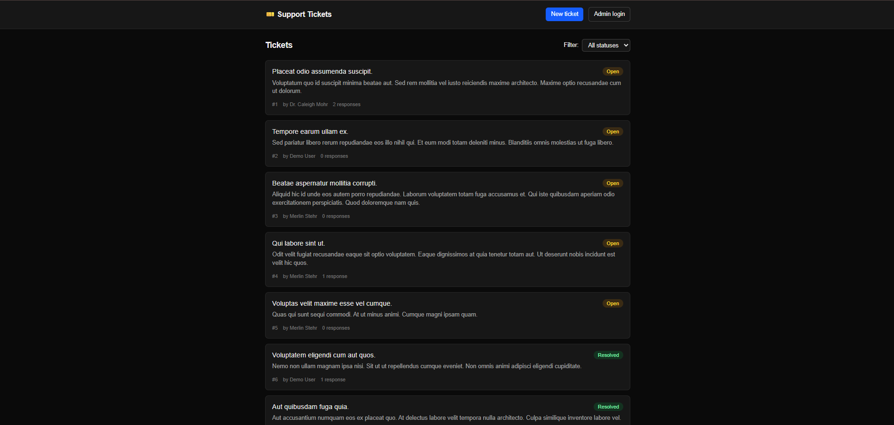
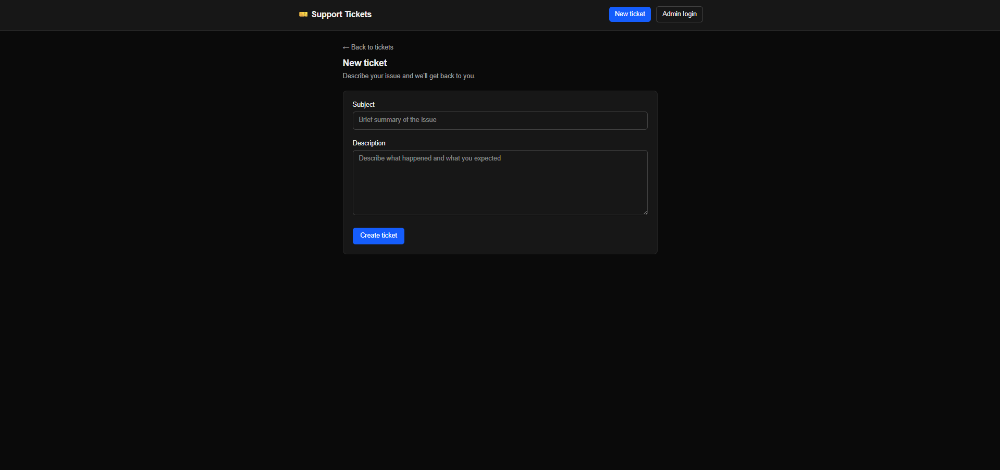
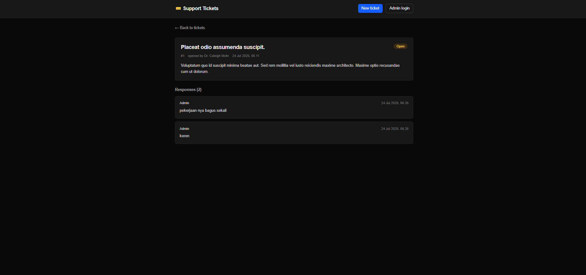
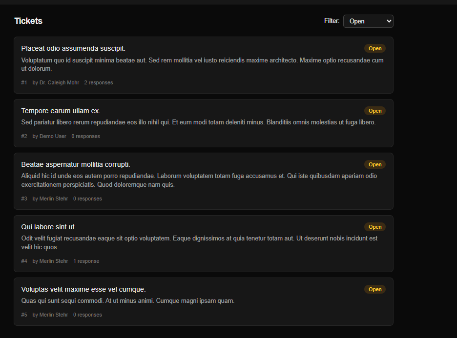
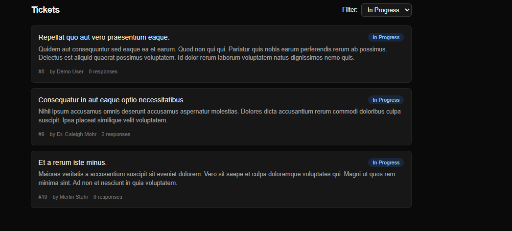
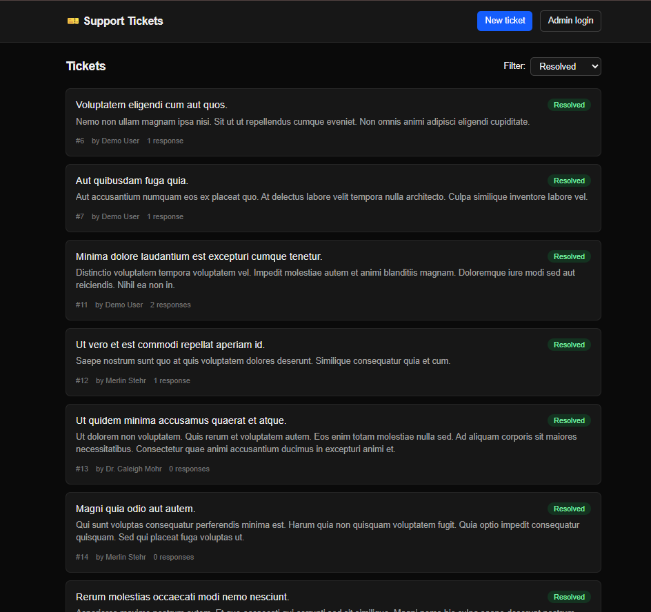
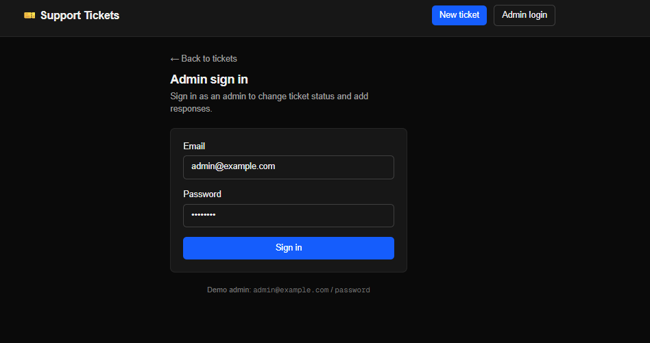
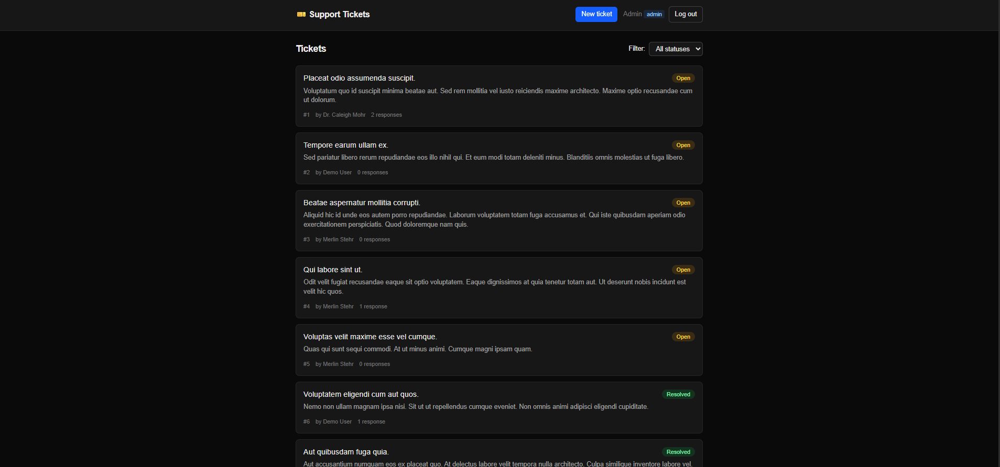
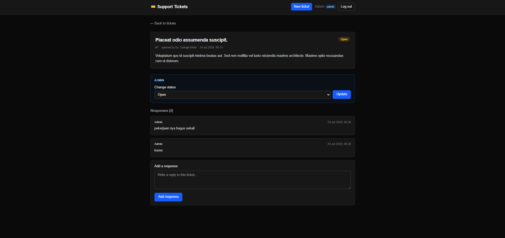

# Support Ticket System

Sistem support ticket sederhana dengan dua peran (user & admin), dibangun sebagai
polyglot monorepo: **API Laravel 13**, **frontend Next.js 16**, dan satu
**service statistik Node 24**.

> **Catatan database:** Proyek ini menggunakan **MySQL** (bukan SQLite seperti pada
> spesifikasi awal) sesuai permintaan. Lihat [ADR-3](docs/decisions.md).

**Estimated time spent:** ±8 jam.

## Daftar Isi

1. [Tech Stack](#tech-stack)
2. [Arsitektur](#arsitektur-architecture)
3. [Setup](#setup)
4. [Environment Variables](#environment-variables)
5. [Migrasi Database](#migrasi-database-database-migrations)
6. [Menjalankan Aplikasi](#menjalankan-aplikasi)
7. [Menjalankan Test](#menjalankan-test)
8. [API Endpoints](#api-endpoints)
9. [Akun Demo](#akun-demo)
10. [Screenshots](#screenshots)
11. [Known Limitations](#known-limitations)
12. [Peningkatan Jika Ada Waktu Lebih](#peningkatan-jika-ada-waktu-lebih-future-improvements)

---

## Tech Stack

| Komponen | Versi |
|---|---|
| PHP | 8.3 (Laravel 13 minimum) |
| Laravel | 13.x |
| Node.js | 24 LTS |
| Next.js | 16.2.11 |
| React | 19.2.x |
| TypeScript | bawaan `create-next-app` |
| Database | MySQL 8.0 |
| Test runner | Pest |
| CSS | Tailwind CSS v4 |

---

## Arsitektur (Architecture)

Monorepo berisi tiga aplikasi yang di-deploy independen dan **tidak saling
berkomunikasi**. Ini bukan microservice — hanya ada satu bounded context
(Ticket), tanpa service discovery, message broker, atau API gateway.

```
support-ticket-system/
├── apps/
│   ├── api/     # Laravel 13 — REST API
│   ├── web/     # Next.js 16 — App Router, server-first
│   └── stats/   # Node 24 + TS — service statistik
└── docs/        # kontrak API + ADR
```

### apps/api — Layered MVC + Action layer

Alur request mengikuti satu jalur yang konsisten:

```
Route → FormRequest (validasi) → Controller (tipis) → Policy (otorisasi)
      → Action (logika bisnis) → Model (Eloquent) → API Resource (bentuk response)
```

Logika bisnis diletakkan pada **tiga Action class** — `CreateTicket`,
`UpdateTicketStatus`, `AddTicketResponse` — masing-masing satu method `handle()`.
Ini membuat logika bisnis dapat diuji tanpa HTTP/database dan menjaga controller
tetap tipis. **Repository Pattern sengaja dihindari** karena Eloquent sudah Active
Record (lihat [ADR-2](docs/decisions.md)). Batas abstraksi: tepat satu layer di
atas Eloquent.

Status ticket (`open` / `in_progress` / `resolved`) dan role user
(`user` / `admin`) disimpan sebagai `string` di database lalu di-cast ke PHP
backed enum di model. Enum `TicketStatus` juga menampung **aturan transisi status**
yang valid.

### apps/web — Next.js App Router, server-first

- **Server Component** untuk semua pembacaan data — fetch langsung ke Laravel dari
  sisi server (`lib/api.ts`).
- **Client Component** hanya pada titik interaktif: form (`TicketForm`) dan filter
  (`StatusFilter`).
- **State filter status disimpan di URL `searchParams`** (`/?status=open`), bukan
  `useState`. Server Component membaca `searchParams` dan melakukan fetch ulang.
- **Route Handler** `app/api/login/route.ts` menukar kredensial dengan Bearer token
  dari Laravel dan menyimpannya sebagai **httpOnly cookie** — token tidak pernah
  tersentuh JavaScript client (lihat [ADR-4](docs/decisions.md)).
- Validasi form berjalan di **dua sisi**: Zod di client + FormRequest di server
  (lihat [ADR-5](docs/decisions.md)).

### apps/stats — Second backend task

Satu file Express yang membaca database MySQL yang sama **secara langsung** via
driver `mysql2` — tidak memanggil API Laravel. Mengembalikan agregat ticket.

---

## Setup

### Prasyarat

- PHP ≥ 8.3 dengan ekstensi `pdo_mysql` aktif
- Composer
- Node.js ≥ 24 dan npm
- MySQL 8.x berjalan di `127.0.0.1:3306` (default: user `root`, tanpa password —
  sesuai Laragon)

Verifikasi cepat:

```bash
php -v                    # >= 8.3
php -m | grep -i mysql    # pdo_mysql aktif
composer -V
node -v                   # v24.x
```

### Langkah setup (manual)

> Repo ini **tidak** menyertakan `make` sebagai keharusan. Jika `make` terpasang,
> tersedia shortcut `make setup` / `make db` (lihat `Makefile`). Jika tidak,
> gunakan langkah manual berikut.

```bash
# 1. Buat database MySQL (app + test)
mysql -u root -h 127.0.0.1 -e "CREATE DATABASE IF NOT EXISTS Support_Ticket_System CHARACTER SET utf8mb4 COLLATE utf8mb4_unicode_ci; CREATE DATABASE IF NOT EXISTS Support_Ticket_System_test CHARACTER SET utf8mb4 COLLATE utf8mb4_unicode_ci;"

# 2. Laravel API
cd apps/api
composer install
cp .env.example .env
php artisan key:generate
php artisan migrate --seed          # lihat bagian Migrasi Database
cd ../..

# 3. Dependencies JavaScript (workspace: web + stats)
npm install

# 4. Environment file frontend & stats
echo "NEXT_PUBLIC_API_URL=http://localhost:8000/api/v1" > apps/web/.env.local
cp apps/stats/.env.example apps/stats/.env    # opsional; default sudah cocok
```

---

## Environment Variables

### `apps/api/.env` (Laravel)

| Variabel | Contoh / default | Keterangan |
|---|---|---|
| `APP_KEY` | *(di-generate)* | wajib — dibuat oleh `php artisan key:generate` |
| `APP_URL` | `http://localhost:8000` | base URL API |
| `FRONTEND_URL` | `http://localhost:3000` | dipakai untuk konfigurasi CORS |
| `DB_CONNECTION` | `mysql` | driver database |
| `DB_HOST` | `127.0.0.1` | host MySQL |
| `DB_PORT` | `3306` | port MySQL |
| `DB_DATABASE` | `Support_Ticket_System` | nama database |
| `DB_USERNAME` | `root` | user MySQL |
| `DB_PASSWORD` | *(kosong)* | password MySQL |

### `apps/web/.env.local` (Next.js)

| Variabel | Contoh | Keterangan |
|---|---|---|
| `NEXT_PUBLIC_API_URL` | `http://localhost:8000/api/v1` | base URL API yang dipanggil frontend |

### `apps/stats/.env` (Node — opsional, ada default)

| Variabel | Default | Keterangan |
|---|---|---|
| `STATS_PORT` | `4000` | port service stats |
| `DB_HOST` | `127.0.0.1` | host MySQL |
| `DB_PORT` | `3306` | port MySQL |
| `DB_USERNAME` | `root` | user MySQL |
| `DB_PASSWORD` | *(kosong)* | password MySQL |
| `DB_DATABASE` | `Support_Ticket_System` | nama database |

> `.env`, `.env.local`, dan `apps/stats/.env` **tidak di-commit** (ada di
> `.gitignore`). Gunakan file `.env.example` sebagai template.

---

## Migrasi Database (Database Migrations)

Skema: tabel `users`, `tickets`, `ticket_responses` (relasi FK
`cascadeOnDelete`). Migration ditulis **portabel** sehingga `DB_CONNECTION` dapat
diganti tanpa mengubah kode.

```bash
cd apps/api

# Jalankan migration + seeder (setup awal)
php artisan migrate --seed

# Reset penuh: drop semua tabel, migrate ulang, seed ulang
php artisan migrate:fresh --seed

# Migrasi saja tanpa seeder
php artisan migrate

# Cek status migrasi
php artisan migrate:status
```

**Seeder** membuat: 1 admin (`admin@example.com`), 3 user biasa (salah satunya
`user@example.com`), ~15 ticket tersebar merata di ketiga status, sebagian dengan
response. Password seragam: `password`.

Shortcut (jika `make` ada): `make fresh`.

---

## Menjalankan Aplikasi

Butuh **tiga terminal** (satu per service). Port: API 8000, Web 3000, Stats 4000.

```bash
# Terminal 1 — Laravel API  → http://localhost:8000
cd apps/api && php artisan serve

# Terminal 2 — Next.js frontend  → http://localhost:3000
npm run dev --workspace=apps/web

# Terminal 3 — Stats service  → http://localhost:4000/stats
npm run dev --workspace=apps/stats
```

Lalu buka **http://localhost:3000** di browser.

Shortcut (jika `make` ada): `make api`, `make web`, `make stats`.

---

## Menjalankan Test

```bash
cd apps/api && php artisan test
```

Shortcut (jika `make` ada): `make test`.

Test berjalan terhadap database MySQL khusus `Support_Ticket_System_test`
(dikonfigurasi di `apps/api/phpunit.xml`) dan memakai `RefreshDatabase`. Cakupan:

| Jenis | File | Isi |
|---|---|---|
| Unit | `tests/Unit/TicketStatusTest.php` | `TicketStatus::label()` + aturan transisi status valid/invalid |
| Integration | `tests/Feature/CreateTicketTest.php` | POST `/tickets` → 201, status awal `open`, `assertDatabaseHas` |
| Validation | `tests/Feature/TicketValidationTest.php` | POST tanpa subject/description → 422 |
| Authorization | `tests/Feature/TicketAuthorizationTest.php` | non-admin → 403, admin → 200, tanpa token → 401 |

Status terakhir: **17 test lulus, 33 assertion**.

---

## API Endpoints

Prefix: `/api/v1`. Kontrak lengkap (request/response tiap endpoint) ada di
[`docs/api.md`](docs/api.md).

| Method | Endpoint | Auth | Sukses |
|---|---|---|---|
| POST | `/login` | — | 200 |
| GET | `/me` | login | 200 |
| POST | `/logout` | login | 200 |
| GET | `/tickets` | — | 200 (`?status=&page=`, paginated) |
| POST | `/tickets` | — | 201 (+ header `Location`) |
| GET | `/tickets/{id}` | — | 200 (menyertakan `responses`) |
| PATCH | `/tickets/{id}/status` | admin | 200 |
| POST | `/tickets/{id}/responses` | admin | 201 |

Endpoint admin memakai `auth:sanctum` + `TicketPolicy` (`role === 'admin'`).
Autentikasi memakai **Bearer token** yang diterbitkan Sanctum.

Service stats (port 4000):

```bash
curl http://localhost:4000/stats
```
```json
{
  "total": 15,
  "by_status": { "open": 5, "in_progress": 5, "resolved": 5 },
  "avg_responses_per_ticket": 1.27,
  "generated_at": "2026-07-24T09:00:00.000Z"
}
```

---

## Akun Demo

Password seragam: `password`

| Email | Role |
|---|---|
| `admin@example.com` | admin |
| `user@example.com` | user |

**Fitur admin** (login lewat tombol *Admin login* di header, atau `/login`):

- **Ubah status ticket** — kontrol pada halaman detail ticket.
- **Tambah response** — form pada halaman detail ticket.
- **Filter ticket berdasarkan status** — dropdown pada halaman list (tersedia
  untuk semua pengguna).

Setelah login, token disimpan sebagai httpOnly cookie; Server Component membaca
peran user via `GET /me` untuk menampilkan kontrol admin. Endpoint mutasi tetap
diproteksi `auth:sanctum` + `TicketPolicy` di server — UI hanya menyembunyikan
kontrol, otorisasi sebenarnya ada di API.

---

## Screenshots

### User Features

**Daftar ticket + filter status**



**Buat ticket baru**



**Detail ticket + thread response**



**Filter berdasarkan status**

| Open | In Progress | Resolved |
|---|---|---|
|  |  |  |

### Admin Features

**Admin login**



**Daftar ticket (tampilan admin)**



**Ubah status & tambah response pada halaman detail**



---

## Known Limitations

- **Create ticket terbuka tanpa auth.** Karena tidak ada registrasi user, ticket
  baru yang dibuat tanpa token diberikan ke *reporter default* (user demo). Ini
  penyederhanaan, bukan model kepemilikan yang sebenarnya.
- **Tanpa rate limiting.** Endpoint create publik rentan spam.
- **Halaman not-found frontend mengembalikan HTTP 200**, bukan 404, karena adanya
  streaming + `loading.tsx` (Suspense boundary) di Next App Router. API sendiri
  tetap mengembalikan 404 dengan benar.
- **Cakupan fitur minimal sesuai scope:** tanpa notifikasi, upload file, soft
  delete, audit log, atau i18n.
- **Test frontend tidak ada** (tidak diwajibkan spesifikasi); stats service juga
  belum punya test otomatis.
- **Tanpa Docker** — seluruh service dijalankan native, sehingga reproduksi
  environment bergantung pada tooling lokal (Laragon).

---

## Peningkatan Jika Ada Waktu Lebih (Future Improvements)

Dengan waktu tambahan, prioritas peningkatan:

1. **Optimistic update pada aksi admin** — saat ini ubah status / tambah response
   memakai Server Action + `revalidatePath` (satu round-trip). Bisa ditingkatkan
   dengan `useOptimistic` agar UI langsung berubah sebelum server merespons.
2. **Model kepemilikan ticket yang benar** — autentikasi user biasa saat membuat
   ticket agar `user_id` mencerminkan pembuat sebenarnya, bukan reporter default.
3. **CI pipeline** (GitHub Actions) — menjalankan `php artisan test`, `tsc
   --noEmit`, ESLint, dan `next build` pada setiap push, plus service MySQL.
4. **Test lebih menyeluruh** — feature test untuk filter+pagination dan aturan
   transisi status via HTTP, test integrasi untuk stats service, serta test
   frontend (Playwright/Vitest) untuk alur create dan tampilan error 422.
5. **Rate limiting** pada endpoint create publik + validasi anti-spam sederhana.
6. **Observability** — structured logging, error tracking (mis. Sentry), dan
   health check per service.
7. **Stats service lebih kaya** — caching hasil, metrik tambahan (rata-rata waktu
   penyelesaian, throughput per hari), dan endpoint `/health`.
8. **Aksesibilitas & UX** — audit a11y (fokus keyboard, ARIA), skeleton yang lebih
   halus, dan dukungan i18n.
9. **Docker Compose** — untuk reproduksi environment (PHP, Node, MySQL) yang
   konsisten lintas mesin.
10. **Hardening database** — review index untuk query filter status, dan
    pengecekan N+1 lanjutan (eager loading sudah diterapkan pada list & detail).
